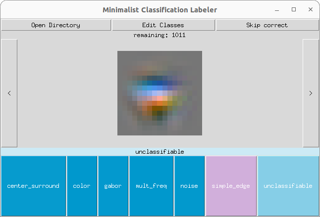

# minimalist-classification-labeler
A very simple python GUI tool allowing you to classify images and store them for usage with torchvisions ImageFolderDataset.



## Usage

To start the program, simply run the python file using

```
python src/gui.py
```

## User Guide

### Open Directory
When opening a directory, all subdirectories are immediately interpreted as classes.
The images in the directory itself will be loaded to be classified.
If there are already images in the subdirectories, one can load them for (re-) classification by clicking the "Load Subdirectories" button.
If applicable, the current label of an image is displayed right above the classification buttons.
Additionally, over the image the information of how many images are left to be labeled is displayed.

### Edit classes
If you want to create new classes or delete existing classes, you can use the "edit classes button".
A text editor will open where each line represents a class.
A directory for the class will however be created only when an image is actually labeled as this class.
In contrast, existing directories are never deleted.

### Autolabels / Predefined labels
If you already have labels or predictions for (some) images, you can provide them by placing a "autolabels.json" file in the directories.
It should contain a dictionary with the image names as keys and a list of predictions (as probabilities) as value:
```
{
    "128.png": [0.7,0.1,0.0,0.0,0.0,0.1,0.1],
    "397.png": [0.0,0.2,0.0,0.1,0.0,0.5,0.1]
}
```

#### Visualization
If such labels are provided - and the length of the probability vector matches the number of defined classes, the class probabilities are visualized via the button color.

#### Skip correctly classified images
If the loaded "autolabel" matches the directory an image is already in, you can skip the classification of these images. This will remove the images from the list of images to be classified and they remain at their location.

### Additional notes
- Make sure every image has a unique name!
    - there is no check whether an image of that name exists if it is moved to a directory
    - also the autolabel lookup makes use of the name as key
- Attention when opening "wrong" directories
    - as the path of images is modified, if you open a "wrong" directory, you should be careful not to create unintentionally directories somewhere or move files around in an unwanted way.